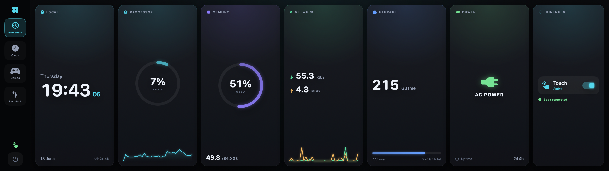
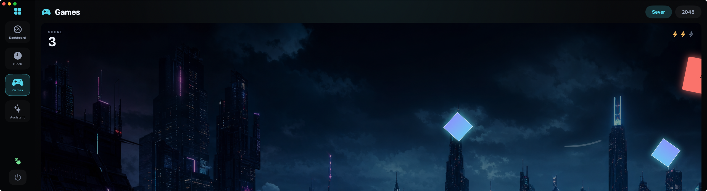

# Xeneon Toolbox

A macOS toolbox for the **Corsair Xeneon Edge** (14.5", 2560×720 touchscreen). It
makes the panel genuinely useful on a Mac: an absolute touch driver plus a set of
full-screen apps designed for the ultrawide strip.

The touch driver is **embedded in the app** — while Xeneon Toolbox runs, touch
works. No LaunchAgent, no kernel extension, no sudo. It opens in native
fullscreen on the Edge and hides the system menu bar.




## Apps

- **Dashboard** — live telemetry deck: CPU, memory, network, storage, power,
  clock/uptime, with hue-coded ring gauges and sparklines, plus a touch on/off
  control.
- **Clock** — local time, world clocks, and a focus (Pomodoro) timer.
- **Games**
  - **Sever** — a cyberpunk neon slash arcade made for the ultrawide: swipe to
    slice data-shards streaming edge-to-edge, dodge the red ICE. Combos, waves,
    lives. (Background art generated with `gpt-image-2`.)
  - **2048** — swipe or use the on-screen pad.
- **Assistant** — chat backed by any OpenAI-compatible endpoint. Set it up
  in-app: pick OpenAI, a local model (Ollama / LM Studio), or a custom endpoint.

## Touch driver

macOS sees the Edge's WCH digitizer but only produces vague relative motion
("touch board"). The toolbox reads its absolute coordinates and injects real
pointer events so taps and drags land where you touch.

- Reports as a mouse-style absolute device: X = GenericDesktop `0x30`,
  Y = `0x31`, contact = Button page `0x09` / Button 1.
- Coordinate ranges: X `0…16383`, Y `0…9599`.
- macOS holds the digitizer exclusively, so the driver runs non-exclusively.

## Build & run

```bash
swift build -c release
swift test                  # unit tests: coordinate mapping, touch state, HID decode, 2048

./scripts/make-app.sh       # build XeneonToolbox.app (with icon)
open XeneonToolbox.app
```

Grant **Xeneon Toolbox** both **Input Monitoring** (read touch) and
**Accessibility** (inject clicks) in System Settings → Privacy & Security. If the
`xeneon-touch` CLI is running, quit it first — only one process can hold the
digitizer.

## Layout

| Target | Kind | Purpose |
| --- | --- | --- |
| `XeneonTouchCore` | library | Pure, tested logic: coordinate mapping, tap/drag state machine, HID decode |
| `XeneonTouchDriver` | library | IOKit HID capture + CoreGraphics injection; `TouchService` |
| `ToolboxKit` | library | Pure app logic: 2048 engine, chat client |
| `XeneonToolbox` | app | SwiftUI apps + embedded touch driver |
| `xeneon-touch` | CLI | Diagnostics (`diagnose`, `list-displays`) and headless `run` |

## Asset generation

`scripts/gen-asset.py` generates background art via OpenAI `gpt-image-2`
(`OPENAI_API_KEY` from the environment — never committed). `scripts/make-icon.swift`
renders the app icon procedurally.
