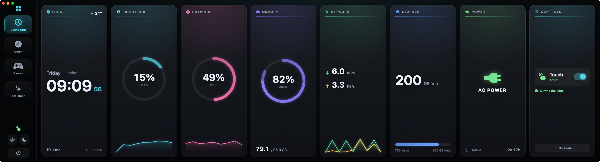
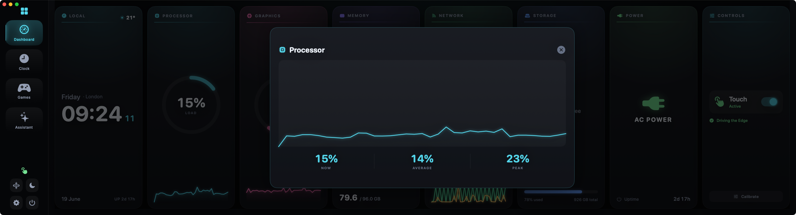
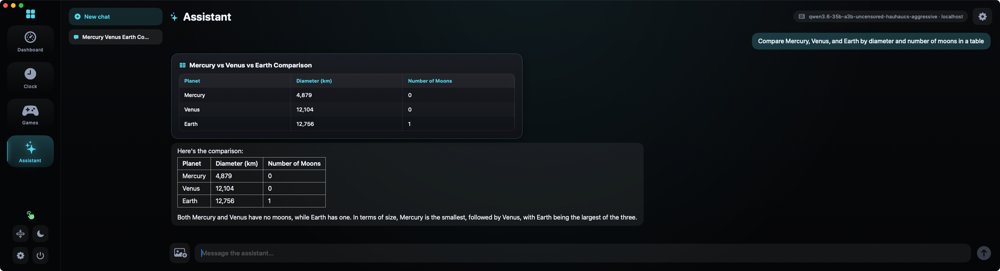

# Xeneon Toolbox

A macOS toolbox for the **Corsair Xeneon Edge** (14.5", 2560×720 touchscreen). It
makes the panel genuinely useful on a Mac: an absolute touch driver plus a set of
full-screen apps designed for the ultrawide strip.

The touch driver is **embedded in the app** — while Xeneon Toolbox runs, touch
works. No LaunchAgent, no kernel extension, no sudo. It opens in native
fullscreen on the Edge and hides the system menu bar.





## Apps

- **Dashboard** — live telemetry deck: CPU, **GPU**, memory, network, storage,
  power, clock/uptime and **current weather** (Open-Meteo + IP geolocation, no
  key), with hue-coded ring gauges and sparklines, plus a touch on/off control.
  **Tap a CPU/GPU/Network tile** to expand a detail view (history graph +
  now/avg/peak).
- **Clock** — local time, world clocks, and a focus (Pomodoro) timer with
  tappable **15 / 25 / 45 min** presets (no keyboard needed).
- **Games** — full web games embedded for the Edge, switchable in-app, with a
  loading spinner and an offline **retry** state:
  - **山海残卷 (Shanhai)** — the card roguelike at shanhai-yi.com.
  - **Rhythm Plus** — the rhythm game at v2.rhythm-plus.com.
- **Assistant** — an agentic chat (SwiftOpenAI) backed by any OpenAI-compatible
  endpoint. It **streams** responses, **renders markdown** (swift-markdown-ui)
  with a pop-in highlight, accepts **images** (vision), and runs **tools**:
  - **Controls the app** — knows the current tab + live stats; can navigate,
    toggle touch, switch display mode, and open games.
  - **Generative UI** — renders results as the clearest format: a key/value
    **card**, a multi-column **table**, a bar/line **chart**, a top-processes
    card, or a **generated image**.
  - **Web** — `web_search`, `fetch_url`. **Files** — list / read / write.
  - **System** — shell commands, clipboard, open URLs/apps, date/time, volume,
    media controls, and now-playing.

  **Conversations persist** (across tab switches and app restarts) — including
  rendered cards/tables/charts — with a sidebar to switch / new / delete and
  model-generated titles. Tool steps show **live** then collapse to a chip; a
  **stop** button cancels a running reply. Sensitive actions ask for
  **Approve / Always allow / Deny** (dangerous ones always ask). Set it up in-app:
  pick OpenAI or a local model (Ollama / LM Studio); models auto-detect into a
  dropdown.
- **Display modes** — **Minimal** (OLED clock + vitals on black) and **Sleep**
  (black, monitoring + weather stopped, drifting clock to save battery / avoid
  burn-in), from the nav rail. A **Settings** overlay (gear) holds touch
  calibration, display modes, and conversation management. Smooth tab + modal
  transitions throughout.

## Touch driver

macOS sees the Edge's WCH digitizer but only produces vague relative motion
("touch board"). The toolbox reads its absolute coordinates and injects real
pointer events so taps and drags land where you touch.

- Reports as a mouse-style absolute device: X = GenericDesktop `0x30`,
  Y = `0x31`, contact = Button page `0x09` / Button 1.
- Coordinate ranges: X `0…16383`, Y `0…9599`.
- macOS holds the digitizer exclusively, so the driver runs non-exclusively.

## Build & run

```bash
swift build -c release
swift test                  # unit tests: coordinate mapping, touch state, HID decode

./scripts/make-app.sh       # build XeneonToolbox.app (with icon)
open XeneonToolbox.app
```

Grant **Xeneon Toolbox** both **Input Monitoring** (read touch) and
**Accessibility** (inject clicks) in System Settings → Privacy & Security. If the
`xeneon-touch` CLI is running, quit it first — only one process can hold the
digitizer.

## Layout

| Target | Kind | Purpose |
| --- | --- | --- |
| `XeneonTouchCore` | library | Pure, tested logic: coordinate mapping, tap/drag state machine, HID decode |
| `XeneonTouchDriver` | library | IOKit HID capture + CoreGraphics injection; `TouchService` |
| `ToolboxKit` | library | Pure app logic: chat client + config |
| `XeneonToolbox` | app | SwiftUI apps + embedded touch driver |
| `xeneon-touch` | CLI | Diagnostics (`diagnose`, `list-displays`) and headless `run` |

## Icon

`scripts/make-icon.swift` renders the app icon procedurally (neon ring gauge).
`scripts/gen-asset.py` is a helper for generating art via OpenAI `gpt-image-2`
(`OPENAI_API_KEY` read from the environment — never committed).
