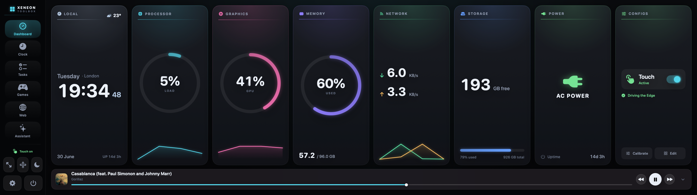
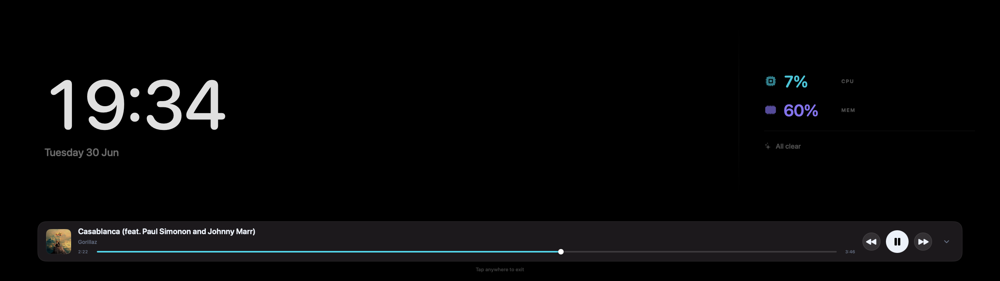
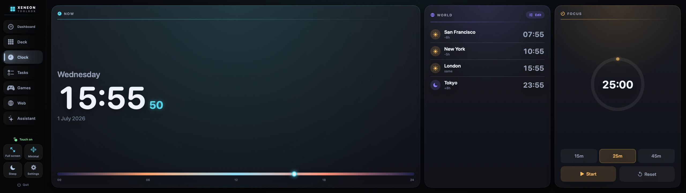
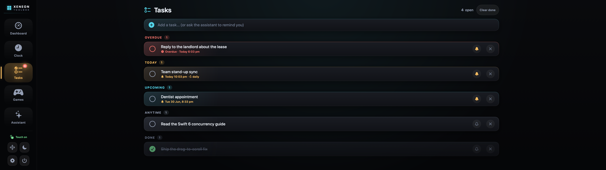
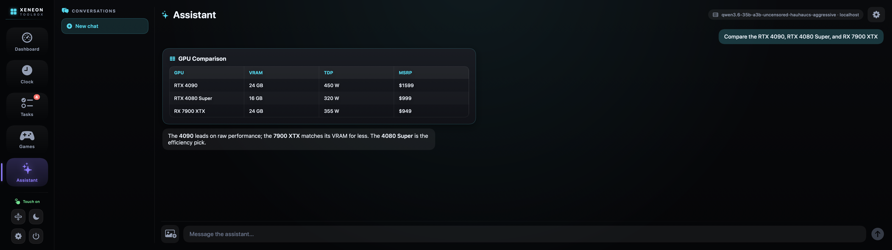
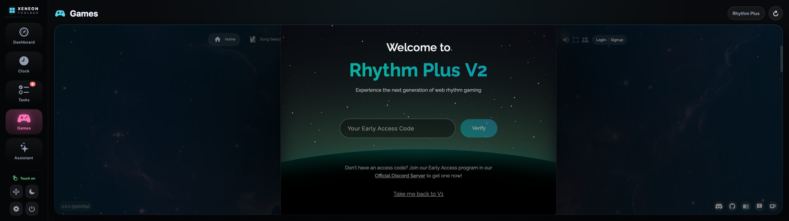
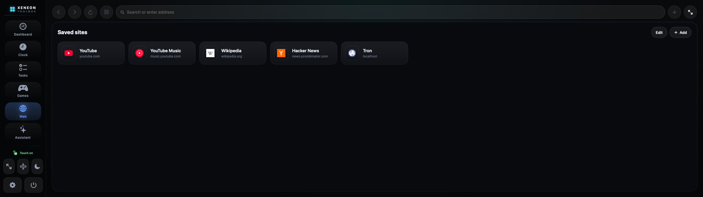
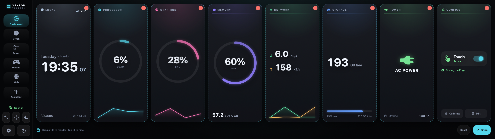
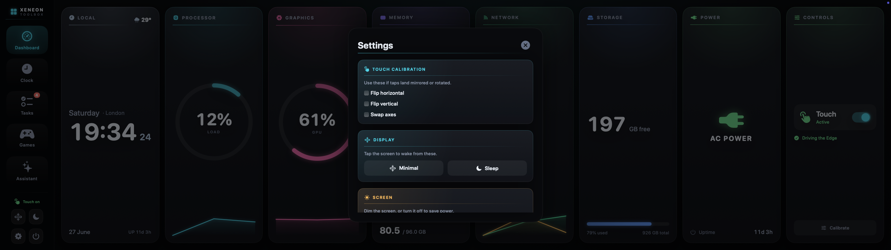
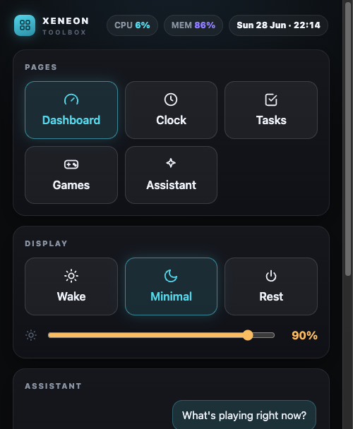

<div align="center">

# Xeneon Toolbox

**Turn the Corsair Xeneon Edge into a Mac companion you actually use.**

A native macOS app for the Edge's 14.5″ · 2560×720 touchscreen — a customizable
system dashboard, world clocks, tasks & reminders, an AI assistant that can drive
the app, a web browser, now-playing media controls, and games. All designed for an
ultrawide strip you operate with your finger.


&nbsp;
&nbsp;
&nbsp;

### [⬇︎ Download for macOS](https://github.com/Shadowhusky/xeneon-toolbox/releases/latest)

Free and open source. If it makes your Edge more useful, you can
[**buy me a coffee ☕**](https://www.buymeacoffee.com/Richardliao).

</div>



---

## Why

Plugged into a Mac, the Edge shows up as a vague “touch board” — taps don't land
where you touch. Xeneon Toolbox fixes that with an **embedded absolute touch
driver** (no kernel extension, no `sudo`, no LaunchAgent) and a set of full-screen
apps built for the strip. While the app runs, the panel just works:

- **Tap** to click, **one-finger drag** to scroll, **two-finger** to scroll or
  pinch-to-zoom; the cursor hides while you touch and returns for the mouse
- **Edge swipes** — up from the bottom to exit fullscreen, down from the top to
  drop to the ambient screen
- Runs as a clean **kiosk** that fills the Edge and hides the menu bar
- Everything you change — your dashboard layout, world clocks, tasks,
  conversations — **persists**

---

## Highlights

- **Customizable dashboard** — CPU, GPU, memory, network, storage, power, clock
  and current weather, with hue-coded ring gauges and sparklines. Tap a tile for a
  detail view (top processes by CPU or memory), or enter Edit to **drag tiles to
  rearrange and hide** the ones you don't need — your layout persists.
- **Now Playing** — control whatever's playing in Spotify or Music: artwork, a
  scrubbable progress bar, and play/skip — on the dashboard and the ambient screen.
- **Web browser** — open and save any site on the Edge, with real favicons,
  fullscreen, and pinch-to-zoom.
- **Clock** — local time with a day-progress bar, **customizable world clocks**
  (day/night + offset cues), and a focus timer.
- **Tasks & reminders** — grouped by Overdue / Today / Upcoming, with recurring
  reminders that fire as system notifications.
- **Assistant** — an agentic chat over any OpenAI-compatible model that can read
  your system, drive the app, search the web, manage tasks, and render results as
  cards, tables, charts, or images.
- **Games** — full web games embedded for the Edge.
- **Ambient modes** — a minimal clock-and-vitals view (with now-playing) and a
  power-saving sleep mode; dim or switch the screen off entirely to save power.
- **Remote control** — drive the Edge from any phone or PC browser on the same
  network: switch pages, rest/wake, set brightness, and talk to the assistant
  (with a voice button). On by default; toggle it in Settings.
- **Stays current** — checks GitHub for new versions and updates itself in place
  (notarized; signature- and developer-verified before it swaps).

---

## Screens

### Ambient

A calm, always-on view: the time as the hero, with key vitals and your next
reminder. Tap anywhere to wake to the full UI.



### Clock

Local time with a day-progress bar, plus world clocks you can add and remove from
a searchable city list — each row shows whether it's day or night there and the
offset from your time.



### Tasks & Reminders

A focused list grouped by urgency. Add a reminder time and it fires as a system
notification — even from another app — and recurring reminders roll forward
automatically.



### Assistant

An agentic chat backed by any OpenAI-compatible endpoint (OpenAI, or local models
via LM Studio / Ollama). It streams replies, renders markdown, accepts images, and
turns answers into the clearest format — here, a comparison table.



### Games

Full web games framed for the Edge, with a branded loading state and an offline
retry. Keyboard-driven games receive your keypresses directly.



### Web

Open any site right on the Edge, or save your favorites to a launcher with their
real favicons. Pages can go fullscreen, and two-finger pinch zooms.



### Make it yours

Tap **Edit** in the Configs tile to rearrange the dashboard: drag a tile to a new
spot, tap **⊖** to hide one (it drops into a tray you can pull it back from), and
**Reset** to start over. Your arrangement — and the Now Playing bar — persist.



### Settings

Touch calibration, display modes, screen brightness (and a true screen-off to save
power), and conversation management — each in its own labeled panel.



### Remote control

When the app runs it also serves a small web remote on your local network, so you
can drive the Edge from your phone or laptop — switch pages, rest or wake it, set
brightness, and chat with the assistant (there's a voice button too).

The default address is **`http://<your-mac-ip>:8765/`** (it falls back to the next
free port if 8765 is taken). The exact link — including its access token — is
shown in **Settings → Remote control**, ready to open on your phone. On by
default, and easy to turn off there.



---

## The Assistant, in depth

- **Voice** — tap the mic to talk to it; speech is transcribed **on-device** (no
  cloud) and sent to the assistant. The web remote has a voice button too.
- **Drives the app** — knows the current tab and live stats; can navigate, toggle
  touch, change display mode, set brightness, and open games.
- **Generative UI** — renders results as a key/value card, a multi-column table, a
  bar/line chart, a top-processes card, or a generated image.
- **Tools** — web search and fetch; list / read / write files; tasks &
  reminders; shell, clipboard, open URLs/apps, volume, media controls, now-playing.
- **Trustworthy** — sensitive actions ask **Approve / Always allow / Deny**
  (irreversible ones always ask). A **stop** button cancels a running reply.
- **Persistent** — conversations (including rendered cards) are saved, with a
  sidebar to switch, start, or delete chats, and model-generated titles.

Set it up in-app: pick OpenAI or a local model; installed models auto-detect into
a dropdown.

---

## How touch works

macOS sees the Edge's WCH digitizer but only emits vague relative motion. The
driver reads its **absolute** coordinates and injects real pointer events so taps
and drags land exactly where you touch.

- Reads the panel's **10-finger digitizer** (X `0…16383`, Y `0…9599`) for genuine
  multi-touch — one finger taps and drags, two fingers scroll or pinch-to-zoom —
  with jitter smoothing and momentum scrolling.
- Runs on a **dedicated high-priority thread**, so a busy UI or a slow brightness
  write can never stall or freeze touch.
- **Seizes** the digitizer so macOS doesn't also move the cursor, and re-seizes
  when the app regains focus so touch is always live. The pointer **hides while
  you touch** and reappears the moment you use a real mouse.
- A finger gesture is classified as a **tap**, a **scroll** (continuous
  scroll-wheel events, since macOS scroll views ignore drags), or a **control
  drag** for sliders. Whole-screen **edge swipes** exit fullscreen or drop to the
  ambient view.

The logic that can be tested without hardware — coordinate mapping, the gesture
state machine, HID decoding — is covered by unit tests.

---

## Build & run

```bash
swift build -c release
swift test                 # coordinate mapping, gesture state machine, HID decode, agent + todo logic

./scripts/make-app.sh      # builds XeneonToolbox.app (icon + bundled m1ddc for brightness)
open XeneonToolbox.app
```

Grant **Xeneon Toolbox** both **Input Monitoring** (read touch) and
**Accessibility** (inject events) in **System Settings → Privacy & Security**.
If the `xeneon-touch` CLI is running, quit it first — only one process can hold
the digitizer.

---

## Project layout

| Target | Kind | Purpose |
| --- | --- | --- |
| `XeneonTouchCore` | library | Pure, tested logic: coordinate mapping, gesture state machine, HID decode |
| `XeneonTouchDriver` | library | IOKit HID capture + CoreGraphics injection (`TouchService`) |
| `ToolboxKit` | library | Pure app logic: chat client, config, tasks, world clocks |
| `XeneonToolbox` | app | SwiftUI apps + embedded touch driver |
| `xeneon-touch` | CLI | Diagnostics (`diagnose`, `list-displays`) and headless `run` |

---

## License

MIT — see [LICENSE](LICENSE).
