<div align="center">

# Xeneon Toolbox

**Turn the Corsair Xeneon Edge into a Mac companion you actually use.**

A native macOS app for the Edge's 14.5″ · 2560×720 touchscreen — a widget
dashboard (system vitals, calendar, tasks, thermals, running apps, clipboard,
now playing), a Stream-Deck launcher, world clocks, tasks & reminders, an AI
assistant that can drive the app, and a web browser. All designed for an
ultrawide strip you operate with your finger — and light enough to run all day
(about 2 % CPU on the dashboard, well under 1 % on the ambient screen).


&nbsp;
&nbsp;
&nbsp;

### [⬇︎ Download for macOS](https://github.com/Shadowhusky/xeneon-toolbox/releases/latest)

Free and open source. If it makes your Edge more useful, you can
[**buy me a coffee ☕**](https://www.buymeacoffee.com/Richardliao).

</div>

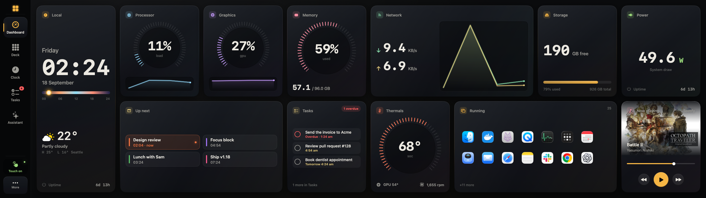

---

## Why

Plugged into a Mac, the Edge shows up as a vague “touch board” — taps don't land
where you touch. Xeneon Toolbox fixes that with an **embedded absolute touch
driver** (no kernel extension, no `sudo`, no LaunchAgent) and a set of full-screen
apps built for the strip. While the app runs, the panel just works:

- **Tap** to click, **one-finger drag** to scroll, **two-finger** to scroll or
  pinch-to-zoom; the cursor hides while you touch, and when your finger lifts
  it goes back to wherever it was on your other display, so a tap on the Edge
  never interrupts what you were doing with the mouse
- **Edge swipes** — up from the bottom to exit fullscreen, down from the top to
  drop to the ambient screen
- Runs as a clean **kiosk** that fills the Edge and hides the menu bar
- Everything you change — your dashboard layout, world clocks, tasks,
  conversations — **persists**

---

## Highlights

- **Widget dashboard** — a two-row grid of tiles sized for the strip: clock &
  weather, CPU, GPU, memory, network, storage and power with hue-coded ring
  gauges and history graphs, plus **Up Next** (your calendar), **Tasks** (tick them
  off in place), **Thermals** (chip temperature and fan speed), **Running apps**
  (tap one to bring it forward, long-press to send it to a screen), **Clipboard**
  (the last few things you copied — tap to copy again), **Now Playing**,
  **Weather** (conditions plus the next hours), **World clocks**, a **Focus**
  timer, **Devices** (connected Bluetooth gear and its charge) and **Quick
  actions** (Boost, keep awake, dark mode, screenshot, lock, sleep display).
  Tiles come in small, wide and tall sizes; hold the board (or More → Edit dashboard)
  to drag, resize, remove, or add from the tile gallery — your board persists.
  Tap a tile for its detail view (top processes; the **hourly and 6-day weather
  forecast**; the Power tile's **energy flow** from the wall to CPU / GPU /
  memory / displays; the Network tile's Wi-Fi, local and public IP). Weather
  locates via Wi-Fi positioning (with IP fallback), or **pin your exact city** in
  Settings.
- **Deck** — a Stream-Deck-style page of big, tappable tiles that quick-launch
  apps (with their real icons), open websites (with their real favicons) in the
  built-in browser, fire **keyboard shortcuts** into whatever app is active, run
  shell commands or webhooks, and control media. Apps open on your main monitor
  (never over the panel); **long-press an app tile** to open it on a specific
  display or **pin one so it always opens there**. **Multi tiles** run a sequence
  of other tiles in one tap. Create and name **multiple Deck pages** for work,
  media, streaming, or app-specific controls, then step between them from the
  header (the web remote follows the selected page too). Search to add — anything
  already on the current page is filtered out — drag to reorder, sort, and give
  any tile a custom SF Symbol or an uploaded image.
- **Control Centre** — swipe down from the top-right — from the full UI or the
  ambient screen — for **Wi-Fi, Bluetooth, Focus and appearance controls** with
  macOS semantics: tap the icon to toggle, tap the tile to pick a network,
  device, or Focus mode. Plus a brightness slider, volume, an **audio-output
  switcher** (speakers / AirPods / headphones), quick actions (Minimal / Sleep /
  Screen off), a touch toggle, and now-playing.
- **Touch gestures** — swipe up from the bottom to exit fullscreen, down from the
  top-left for the ambient screen, and in from a side edge to flip between apps
  with a natural page-turn animation (from the normal UI the swipe enters
  fullscreen as it switches); a first-run tutorial teaches them.
- **Native resolution, guided** — macOS tends to bring the Edge up at 1920×1080,
  which stretches the picture and squeezes the Toolbox. The app notices, and
  offers a one-tap switch to **2560 × 720** (with Undo) or walks you through
  Displays settings. Touch keeps working in any mode meanwhile.
- **Now Playing** — control whatever's playing in Spotify or Music: artwork, a
  scrubbable progress bar, and play/skip — on the dashboard and the ambient
  screen. Tap the artwork for a **full-screen player** with big album art and a
  colour-matched blurred backdrop.
- **Never steals focus** — tap the Edge while you work; the panel responds (even
  typing into its search fields) without pulling focus from the app you're
  working in on the other screen.
- **The panel owns the Edge** — the Toolbox always stays on top of the Edge, so
  no window can ever cover it; apps you launch open on your main monitor. Need
  the screen? **Hide the panel into a small floating badge** (drag it anywhere)
  and use any app on the Edge — tap the badge to bring the Toolbox back.
- **Clock** — local time with a day-progress bar, **customizable world clocks**
  (day/night + offset cues), and a **focus timer** that keeps running while you
  switch tabs — with a live pill on the ambient screen and a chime when it's done.
- **Tasks & reminders** — grouped by Overdue / Today / Upcoming, with recurring
  reminders that fire as system notifications.
- **Assistant** — an agentic chat over any OpenAI-compatible model that can read
  your system, drive the app, search the web, manage tasks, and render results as
  cards, tables, charts, or images.
- **Ambient modes** — a minimal clock-and-vitals view with current weather, your
  **next calendar event** (tap it for today's full agenda), and now-playing; plus
  a power-saving sleep mode — dim or switch the screen off entirely to save power.
- **Remote control** — drive the Edge from any phone or PC browser on the same
  network: **run any deck tile**, control **now-playing** (play/skip) and system
  volume, switch pages, rest/wake, set brightness, and talk to the assistant
  (with a voice button). On by default; toggle it in Settings.
- **iCloud backup** — back up your layout, deck, and preferences to iCloud Drive
  and restore them on another Mac, from Settings.
- **Boost** — one tap shows what's heavy and in the background, pre-selects the
  apps worth quitting, and quits them the polite way (unsaved work asks first),
  then tells you what it freed. No fake "RAM cleaning": closing apps you're not
  using is the one thing that reliably makes a Mac feel faster.
- **Stays current, quietly** — new releases download and verify in the
  background (notarized, signature, developer and checksum checked), then
  install themselves the next time the panel has been idle for a while or when
  you quit. One small notice, no modal, and the previous version is kept until
  the new one is confirmed running. Choose *Automatic*, *Ask first* or *Off* in
  Settings.
- **Permissions, guided** — anything that needs macOS's permission (Calendar,
  Location, Input Monitoring, Accessibility, microphone, Bluetooth) shows an
  *Allow* button that asks the system, opens the exact Privacy & Security pane
  if macOS won't prompt, and confirms by itself the moment you flip the switch.
  Settings lists them all with live status.

---

## Screens

### Deck

A Stream-Deck-style launcher with named pages: big tiles that open apps (with their real macOS
icons and a dock-style dot on the ones already running), launch websites (with
their real favicons) in the built-in browser, fire **recorded keyboard
shortcuts** system-wide, run shell commands or webhooks, or control media.
**Multi tiles** chain your other tiles into one tap — pick them in the order
they should run. **Long-press an app tile** to open or move it to any display — the picker
shows where it currently lives, lets you **pin a screen** it should always open
on, and choosing the **Xeneon Edge** hands the panel over: the Toolbox collapses
into its floating badge and the app takes the screen (tap the badge to swap back). The grid scrolls when your deck outgrows the panel. Tap
**Edit** to drag tiles into any order, remove them, or tap the pencil to
**rename / re-icon / retarget** a tile in place, **Sort** alphabetically or by
type (with a confirmation before it replaces a hand-arranged order), and **Add**
from a searchable picker that hides what's already on the current page — including
custom actions with an SF Symbol or your own uploaded icon. Tap the page name to
create, rename, switch, or remove pages without disturbing the others.

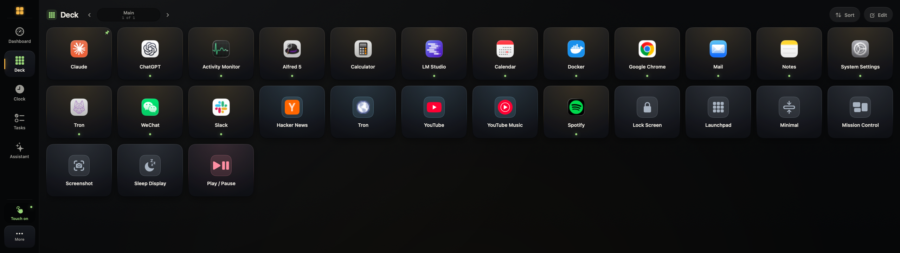

### Control Centre

Swipe down from the top-right edge for a compact control panel — available over
the full UI and the ambient screen alike. The connectivity tiles work like
macOS's own Control Centre: **tap the circular icon to toggle the radio, tap the
rest of the tile to expand a picker** — nearby Wi-Fi networks (tap to join, tap
the connected one to disconnect), paired Bluetooth devices (tap to connect or
disconnect), and your Focus modes. An Appearance tile flips system dark mode,
and below sit brightness, volume, **audio output and input switchers** (tap to
send sound to your speakers/AirPods/headphones or pick a microphone), quick
actions including **Keep Awake** (stop the Mac sleeping, like Amphetamine), a
touch toggle, and now-playing.

Some of it needs one-time grants: allow **Location** for Wi-Fi network names,
**Full Disk Access** for Focus state, and a Shortcut named "Toggle Focus" (built
from the Set Focus action) for Focus toggling — tiles that can't work yet hide
themselves or explain what to enable.

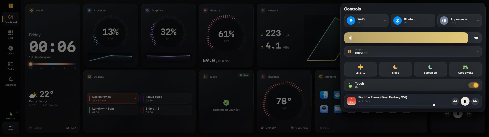

### Ambient

A calm, always-on view: the time as the hero, with current weather, key vitals,
and your next reminder. Tap anywhere to wake to the full UI.

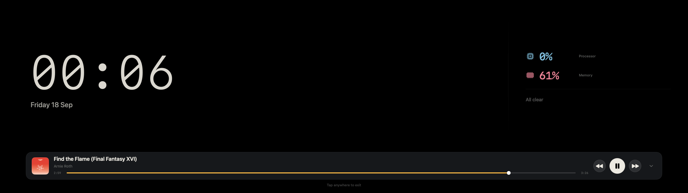

### Clock

Local time with a day-progress bar, plus world clocks you can add and remove from
a searchable city list — each row shows whether it's day or night there and the
offset from your time. A **focus timer** (15 / 25 / 45-minute presets) keeps
counting even when you leave the Clock tab: while it runs, a pill shows the time
left on the ambient screen and a dot marks the Clock tab, and a chime plus an
on-screen alert let you know when the session is done.

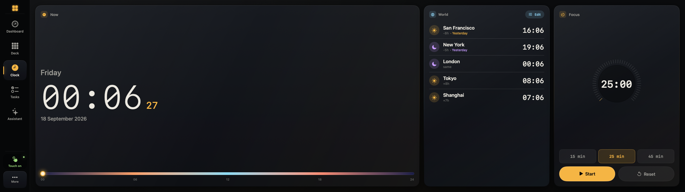

### Tasks & Reminders

A focused list grouped by urgency. Tap a task's title to rename it in place. Add
a reminder — a quick preset or a **custom date & time** — and it fires as a system
notification even from another app; recurring reminders roll forward automatically.

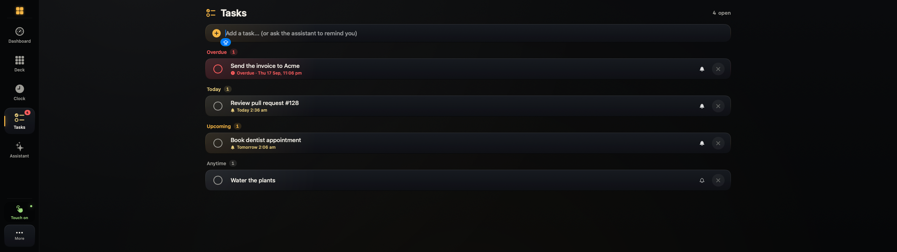

### Assistant

An agentic chat backed by any OpenAI-compatible endpoint (OpenAI, or local models
via LM Studio / Ollama). It streams replies, renders markdown, accepts images, and
turns answers into the clearest format — here, a comparison table.

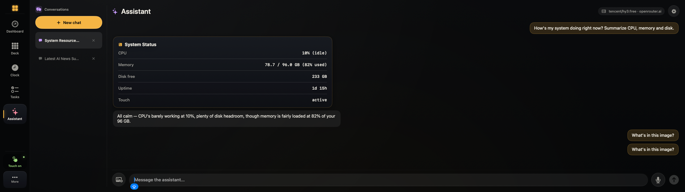

### Web

Websites live on the Deck — tap a website tile and it opens right on the Edge in
the built-in browser, with fullscreen and two-finger pinch-to-zoom. Tap **+** in
the toolbar to save the page you're on back to the Deck with its real favicon.

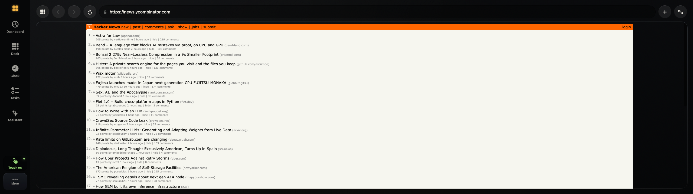

### Make it yours

Hold the board (or tap **More → Edit dashboard**) to rearrange: drag a tile to a
new spot, tap **⊖** to remove one, tap the **S / W / T** badge to cycle its size,
and **Add tile** opens a gallery of everything not on the board with the sizes it
supports. The grid is 2 rows × 8 cells; a small tile takes one cell, wide and
tall take two. **Reset** restores the starter board. Your board persists.

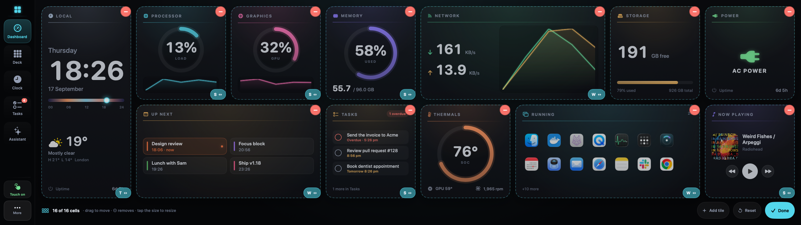

### Resolution guide

If the Edge isn't at its native 2560 × 720 — macOS marks 1920 × 1080 as the
panel's default — the Toolbox says so and fixes it in one tap, with a 15-second
Undo, or shows the manual steps when the native mode is hidden.

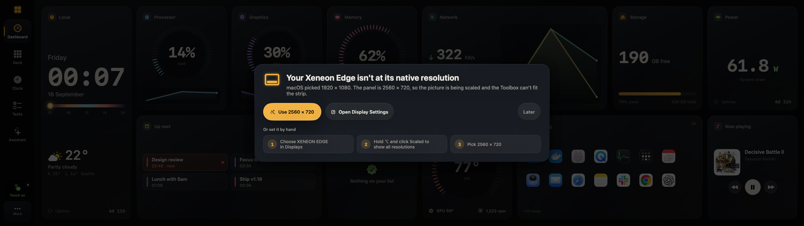

### Settings

The panel's resolution and touch status (with a one-tap **Restart touch**),
calibration, display modes, weather location (pin your exact city if the
automatic lookup is off), screen brightness (and a true screen-off to save
power), remote control, and conversation management — each in its own labeled
panel.

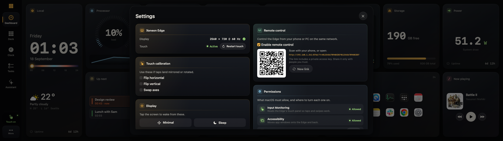

### Remote control

When the app runs it also serves a small web remote on your local network, so you
can drive the Edge from your phone or laptop — **run any deck tile** (your whole
Stream-Deck, from your pocket), control **now-playing** with play/skip and a
volume slider, switch pages, rest or wake it, set brightness, and chat with the
assistant (there's a voice button too).

The default address is **`http://<your-mac-ip>:8765/`** (it falls back to the next
free port if 8765 is taken). The exact link — including its access token — is
shown in **Settings → Remote control**, ready to open on your phone. On by
default, and easy to turn off there.

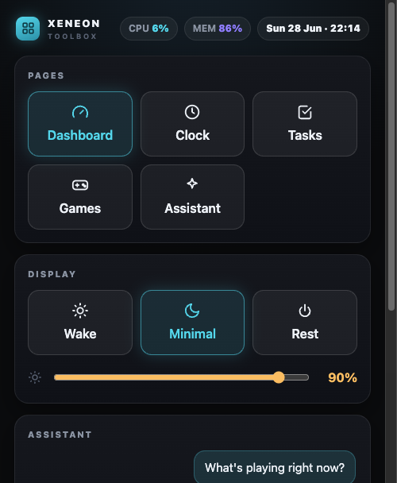

---

## The Assistant, in depth

- **Voice** — tap the mic to talk to it; speech is transcribed **on-device** (no
  cloud) and sent to the assistant. The web remote has a voice button too.
- **Drives the app** — knows the current tab and live stats; can navigate, toggle
  touch, change display mode, and set brightness.
- **Generative UI** — renders results as a key/value card, a multi-column table, a
  bar/line chart, a top-processes card, or a generated image.
- **Tools** — web search and fetch; list / read / write files; tasks &
  reminders; shell, clipboard, open URLs/apps, volume, media controls, now-playing.
- **Trustworthy** — sensitive actions ask **Approve / Always allow / Deny**
  (irreversible ones always ask). A **stop** button cancels a running reply.
- **Persistent** — conversations (including rendered cards) are saved, with a
  sidebar to switch, start, or delete chats, and model-generated titles.

Set it up in-app: pick OpenAI or a local model; installed models auto-detect into
a dropdown.

---

## How touch works

macOS sees the Edge's WCH digitizer but only emits vague relative motion. The
driver reads its **absolute** coordinates and injects real pointer events so taps
and drags land exactly where you touch.

- Reads the panel's **10-finger digitizer** (X `0…16383`, Y `0…9599`) for genuine
  multi-touch — one finger taps and drags, two fingers scroll or pinch-to-zoom —
  with jitter smoothing and momentum scrolling.
- Runs on a **dedicated high-priority thread**, so a busy UI or a slow brightness
  write can never stall or freeze touch.
- **Seizes** the digitizer so macOS doesn't also move the cursor, and keeps it:
  the driver is rebuilt on every wake, unlock and display change, the panel is
  tracked by identity (not by resolution) so its position is always current,
  and a seize macOS refuses is retried forever. The pointer **hides while you
  touch** and, once the gesture (and any scroll momentum) ends, **returns to
  where it was** before the finger landed; if you moved the real mouse in the
  meantime, it stays where you put it.
- A finger gesture is classified as a **tap**, a **scroll** (continuous
  scroll-wheel events, since macOS scroll views ignore drags), or a **control
  drag** for sliders. Whole-screen **edge swipes** exit fullscreen or drop to the
  ambient view.

The logic that can be tested without hardware — coordinate mapping, the gesture
state machine, HID decoding — is covered by unit tests.

---

## Build & run

```bash
swift build -c release
swift test                 # coordinate mapping, gesture state machine, HID decode, agent + todo logic

./scripts/make-app.sh      # builds XeneonToolbox.app (icon + bundled m1ddc for brightness)
open XeneonToolbox.app

.build/release/xeneon-touch display-modes   # the Edge's identity, current mode and every mode it offers
.build/release/xeneon-touch set-mode 28     # switch it (mode numbers from display-modes)
```

Grant **Xeneon Toolbox** both **Input Monitoring** (read touch) and
**Accessibility** (inject events) in **System Settings → Privacy & Security**.
If the `xeneon-touch` CLI is running, quit it first — only one process can hold
the digitizer.

---

## Project layout

| Target | Kind | Purpose |
| --- | --- | --- |
| `XeneonTouchCore` | library | Pure, tested logic: coordinate mapping, gesture state machine, HID decode |
| `XeneonTouchDriver` | library | IOKit HID capture + CoreGraphics injection (`TouchService`), Edge display identity and mode switching |
| `ToolboxKit` | library | Pure app logic: chat client, config, tasks, world clocks |
| `XeneonToolbox` | app | SwiftUI apps + embedded touch driver |
| `xeneon-touch` | CLI | Diagnostics (`diagnose`, `list-displays`, `display-modes`, `set-mode`) and headless `run` |

---

## License

MIT — see [LICENSE](LICENSE).
